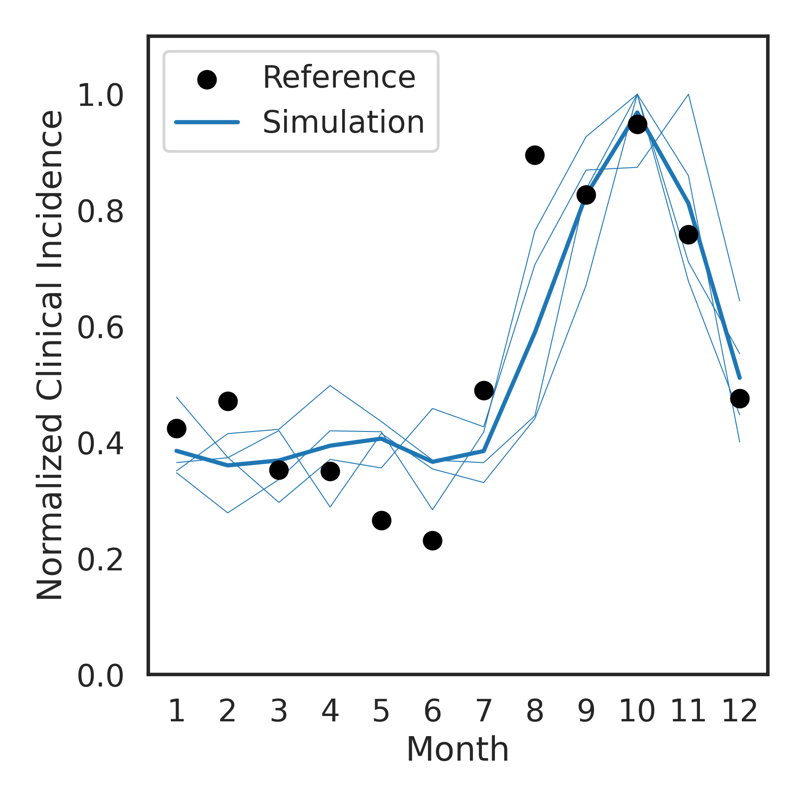
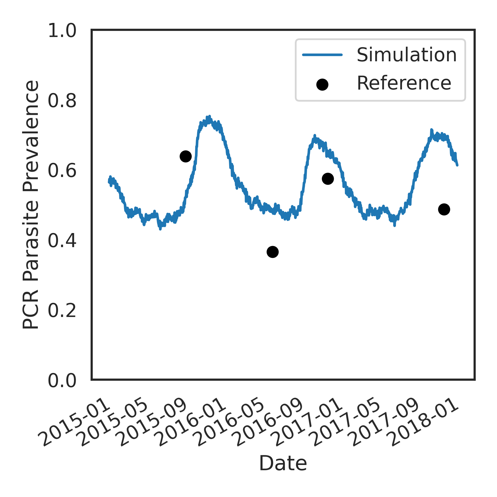
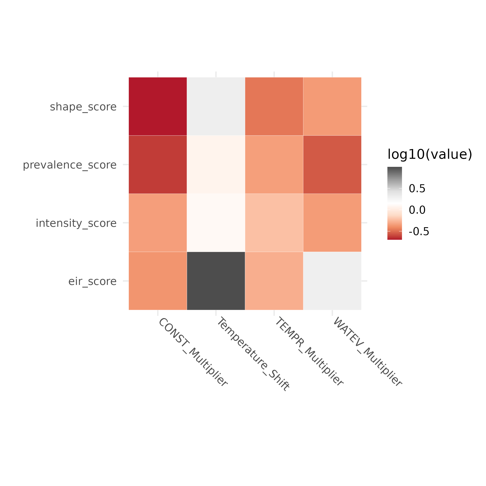

# environment_calibration

## Background

Our goal is to adapt a botorch multi-objective Bayesian optimization workflow to select EMOD habitat & climate parameters to fit reference site seasonality.

Status Summary

|               | Tested                                                                                               | *Not Yet Tested*                              |
|:-------------:|:------------------------------------|:-------------------|
| Interventions | treatment-seeking<br>non-malaria fever treatment<br>SMC(vaccDrug)<br>bednets (season- and age-dependent) | IRS<br>Campaigns (MSAT/MDA)|
|    Vectors    | *arabiensis*<br>*gambiae*<br>*funestus*                                                              |                                               |
|   Habitats    | constant<br>temporary rainfall<br>water vegetation                                                   | linear spline                                 |

## Instructions

Before following the steps below, please **fork** this repository and clone it to your local machine

For Quest users:

``` bash
#navigate to your home directory or desired project location (ex. /projects/<your_net_id>/)
cd ~

# initialize git
git init

# clone repository and submodules
git clone <ssh path to your fork of the repository> --recursive
```

<details>

<summary>Step 1: Create Virtual Environment</summary>

<br> To start, create a virtual environment containing botorch, idmtools, emodpy, and other required packages.

**Example:** Creating an environment named `pytorch_test` inside my home directory `my_environments` folder

``` bash
module purge all
module load mamba
mamba create --prefix=/home/tmh6260/my_environments/pytorch_test -c conda-forge pytorch=1.11[build=cuda112*] numpy python=3.9 cudatoolkit=11.2
```
Running the three lines above will produce the following output:

```bash

                  __    __    __    __
                 /  \  /  \  /  \  /  \
                /    \/    \/    \/    \
███████████████/  /██/  /██/  /██/  /████████████████████████
              /  / \   / \   / \   / \  \____
             /  /   \_/   \_/   \_/   \    o \__,
            / _/                       \_____/  `
            |/
        ███╗   ███╗ █████╗ ███╗   ███╗██████╗  █████╗
        ████╗ ████║██╔══██╗████╗ ████║██╔══██╗██╔══██╗
        ██╔████╔██║███████║██╔████╔██║██████╔╝███████║
        ██║╚██╔╝██║██╔══██║██║╚██╔╝██║██╔══██╗██╔══██║
        ██║ ╚═╝ ██║██║  ██║██║ ╚═╝ ██║██████╔╝██║  ██║
        ╚═╝     ╚═╝╚═╝  ╚═╝╚═╝     ╚═╝╚═════╝ ╚═╝  ╚═╝

        mamba (1.4.2) supported by @QuantStack

        GitHub:  https://github.com/mamba-org/mamba
        Twitter: https://twitter.com/QuantStack

█████████████████████████████████████████████████████████████


Looking for: ['pytorch=1.11[build=cuda112*]', 'numpy', 'python=3.9', 'cudatoolkit=11.2']

error    libmamba Could not open lockfile '/hpc/software/mamba/23.1.0/pkgs/cache/cache.lock'
error    libmamba Could not open lockfile '/hpc/software/mamba/23.1.0/pkgs/cache/cache.lock'
warning  libmamba Could not parse state file: Could not load cache state: [json.exception.type_error.302] type must be string, but is null
warning  libmamba Could not remove state file "/hpc/software/mamba/23.1.0/pkgs/cache/09cdf8bf.state.json": Permission denied
conda-forge/noarch                                  19.8MB @   4.9MB/s  4.4s
conda-forge/linux-64                                46.3MB @   4.6MB/s 10.6s
Transaction

  Prefix: /home/tmh6260/my_environments/pytorch_test

  Updating specs:

   - pytorch=1.11[build=cuda112*]
   - numpy
   - python=3.9
   - cudatoolkit=11.2


  Package                Version  Build                  Channel                    Size
──────────────────────────────────────────────────────────────────────────────────────────
  Install:
──────────────────────────────────────────────────────────────────────────────────────────

  + _libgcc_mutex            0.1  conda_forge            conda-forge/linux-64     Cached
  + _openmp_mutex            4.5  2_kmp_llvm             conda-forge/linux-64     Cached
  + bzip2                  1.0.8  h4bc722e_7             conda-forge/linux-64     Cached
  + ca-certificates    2024.8.30  hbcca054_0             conda-forge/linux-64     Cached
  + cffi                  1.17.1  py39h15c3d72_0         conda-forge/linux-64     Cached
  + cuda-version            11.2  hb11dac2_3             conda-forge/noarch       Cached
  + cudatoolkit           11.2.2  hc23eb0c_13            conda-forge/linux-64     Cached
  + cudnn               8.9.7.29  hbc23b4c_3             conda-forge/linux-64     Cached
  + ld_impl_linux-64        2.43  h712a8e2_2             conda-forge/linux-64      669kB
  + libblas                3.9.0  16_linux64_mkl         conda-forge/linux-64     Cached
  + libcblas               3.9.0  16_linux64_mkl         conda-forge/linux-64     Cached
  + libffi                 3.4.2  h7f98852_5             conda-forge/linux-64     Cached
  + libgcc                14.2.0  h77fa898_1             conda-forge/linux-64      849kB
  + libgcc-ng             14.2.0  h69a702a_1             conda-forge/linux-64       54kB
  + libhwloc              2.11.1  default_hecaa2ac_1000  conda-forge/linux-64     Cached
  + libiconv                1.17  hd590300_2             conda-forge/linux-64     Cached
  + liblapack              3.9.0  16_linux64_mkl         conda-forge/linux-64     Cached
  + libnsl                 2.0.1  hd590300_0             conda-forge/linux-64     Cached
  + libprotobuf           3.20.3  h3eb15da_0             conda-forge/linux-64     Cached
  + libsqlite             3.47.0  hadc24fc_1             conda-forge/linux-64      875kB
  + libstdcxx             14.2.0  hc0a3c3a_1             conda-forge/linux-64        4MB
  + libstdcxx-ng          14.2.0  h4852527_1             conda-forge/linux-64       54kB
  + libuuid               2.38.1  h0b41bf4_0             conda-forge/linux-64     Cached
  + libxcrypt             4.4.36  hd590300_1             conda-forge/linux-64     Cached
  + libxml2               2.13.4  h064dc61_2             conda-forge/linux-64      689kB
  + libzlib                1.3.1  hb9d3cd8_2             conda-forge/linux-64       61kB
  + llvm-openmp           19.1.3  h024ca30_0             conda-forge/linux-64        3MB
  + magma                  2.5.4  hc72dce7_4             conda-forge/linux-64     Cached
  + mkl                 2022.2.1  h6508926_16999         conda-forge/linux-64     Cached
  + nccl                2.23.4.1  h03a54cd_2             conda-forge/linux-64      134MB
  + ncurses                  6.5  he02047a_1             conda-forge/linux-64     Cached
  + ninja                 1.12.1  h297d8ca_0             conda-forge/linux-64     Cached
  + numpy                 1.26.4  py39h474f0d3_0         conda-forge/linux-64     Cached
  + openssl                3.3.2  hb9d3cd8_0             conda-forge/linux-64     Cached
  + pip                   24.3.1  pyh8b19718_0           conda-forge/noarch          1MB
  + pycparser               2.22  pyhd8ed1ab_0           conda-forge/noarch       Cached
  + python                3.9.20  h13acc7a_1_cpython     conda-forge/linux-64       24MB
  + python_abi               3.9  5_cp39                 conda-forge/linux-64     Cached
  + pytorch               1.11.0  cuda112py39ha0cca9b_1  conda-forge/linux-64     Cached
  + readline                 8.2  h8228510_1             conda-forge/linux-64     Cached
  + setuptools            75.3.0  pyhd8ed1ab_0           conda-forge/noarch        780kB
  + sleef                    3.7  h1b44611_0             conda-forge/linux-64        2MB
  + tbb                2021.13.0  h84d6215_0             conda-forge/linux-64     Cached
  + tk                    8.6.13  noxft_h4845f30_101     conda-forge/linux-64     Cached
  + typing_extensions     4.12.2  pyha770c72_0           conda-forge/noarch       Cached
  + tzdata                 2024b  hc8b5060_0             conda-forge/noarch        122kB
  + wheel                 0.44.0  pyhd8ed1ab_0           conda-forge/noarch       Cached
  + xz                     5.2.6  h166bdaf_0             conda-forge/linux-64     Cached

  Summary:

  Install: 48 packages

  Total download: 172MB

──────────────────────────────────────────────────────────────────────────────────────────


Confirm changes: [Y/n] **Y**
```

When the prompt appears asking you to Confirm changes: [Y/n]. **Enter 'Y'**

``` bash
libzlib                                             61.0kB @ 214.5kB/s  0.3s

Downloading and Extracting Packages
tzdata                                             122.4kB @ 273.1kB/s  0.1s
Preparing transaction: done
Verifying transaction: done━━━━━━━━━━━━━━━━━━━━━━━━━━━━━━━━━━━━━━━━━━━━━━━━━━━━━━━━━━━━━━━━━━━━━━━━━━━━━━━━━━━━━━━━━━━━━━━━━━━━━━━━━━━━━━━━━━━━━━━━━━━━━━━━━━━━━━━━━━━━━━━━━━━━━━━━━━━━━━━━━━━━━━━━━━━━━━━━━━━━━━━━━━━━━━━━━━━━━━━━━━━━━━━━━━━━━━━━━━━━━━━━━━━━━━━━━━━━━━━━━━━━━━━━━━━━━━━━━━━━━━━━━━━━━ 171.6MB / 171.6MB                            2.9s
Executing transaction: \ By downloading and using the CUDA Toolkit conda packages, you accept the terms and conditions of the CUDA End User License Agreement (EULA): https://docs.nvidia.com/cuda/eula/index.html
[+] 8.2s
\ By downloading and using the cuDNN conda packages, you accept the terms and conditions of the NVIDIA cuDNN EULA -━━━━━━━━━━━━━━━━━━━━━━━━━━━━━━━━━━━━━━━━━━━━━━━━━━━━━━━━━━━━━━━━━━━━━━━━━━━━━━━━━━━━━━━━━━━━━━━━━━━━━━━━━━━━━━━━━━━━━━━━━━━━━━━━━━━━━━━━━━━━━━━━━━━━━━━━━━━━━━━━━━━━━━━━━━━━━━━━━━━━━ 171.6MB / 171.6MB                            2.9s
  https://docs.nvidia.com/deeplearning/cudnn/sla/index.html
[+] 8.1s
/ wnloading      ━━━━━━━━━━━━━━━━━━━━━━━━━━━━━━━━━━━━━━━━━━━━━━━━━━━━━━━━━━━━━━━━━━━━━━━━━━━━━━━━━━━━━━━━━━━━━━━━━━━━━━━━━━━━━━━━━━━━━━━━━━━━━━━━━━━━━━━━━━━━━━━━━━━━━━━━━━━━━━━━━━━━━━━━━━━━━━━━━━━━━━━━━━━━━━━━━━━━━━━━━━━━━━━━━━━━━━━━━━━━━━━━━━━━━━━━━━━━━━━━━━━━━━━━━━━━━━━━━━━━━━━━━━━━━━━━━━━━━━━ 171.6MB / 171.6MB                            2.9s
done
python                                              23.7MB @  26.0MB/s  0.4s
To activate this environment, use                  133.5MB @  46.1MB/s  2.4s
[+] 7.7s
     $ mamba activate /home/tmh6260/my_environments/pytorch_test━━━━━━━━━━━━━━━━━━━━━━━━━━━━━━━━━━━━━━━━━━━━━━━━━━━━━━━━━━━━━━━━━━━━━━━━━━━━━━━━━━━━━━━━━━━━━━━━━━━━━━━━━━━━━━━━━━━━━━━━━━━━━━━━━━━━━━━━━━━━━━━━━━━━━━━━━━━━━━━━━━━━━━━━━━━━━━━━━━━━━━━━━━━━━━━━━━━━━━━━━━━━━━━━━━━━━━━━━━━━━━━━━━━━━━━━ 171.6MB / 171.6MB                            2.9s

To deactivate an active environment, use

     $ mamba deactivate
```

Activate your virtual environment

``` bash
source activate /home/tmh6260/my_environments/pytorch_test
```

Add 2 additional conda packages

``` bash
conda install icu=75.1
conda install zstd=1.5.6
```

Some packages need to be installed or specified using `pip`. To add them:

``` bash
# pip install others emodpy-malaria and idmtools
pip install emodpy-malaria --ignore-installed --index-url=https://packages.idmod.org/api/pypi/pypi-production/simple 

# copy idm_tools_platform_slurm v1.7.11 from emodpy-torch environment
cp -r /projects/b1139/environments/emodpy-torch/lib/python3.9/site-packages/idmtools_platform_slurm/ /<PATH TO YOUR ENVIRONMENT>/lib/python3.9/site-packages/idmtools_platform_slurm

# pip install others from requirements.txt
pip install -r /projects/b1139/environments/emodpy-torch/requirements.txt

# pip install a few more required packages 
pip install gpytorch
pip install botorch==0.8.1
pip install seaborn
```

</details>

<details>

<summary>Step 2: Customize site-specific inputs</summary>

<br>

0.  Update **VENV_PATH** in manifest.py and supply the same virtual environment to the placeholder in sbatch_run_calib.sh

1.  Describe reference site simulation options

    -   Example **simulation_coordinator.csv**

        | option                           | value                                       | description                                                          |
        |-----------------|-----------------|--------------------------------------|
        | site                             | Nanoro                                      | site name                                                            |
        | lat                              | 12.68                                       | site latitude                                                        |
        | lon                              | -2.19                                       | site longitude                                                       |
        | climate_start_year               | 2010                                        | First year of climate data to request from ERA5                      |
        | climate_year_dur                 | 10                                          | \# years of climate data to pull from ERA5                           |
        | pop                              | 1000                                        | simulated population                                                 |
        | birth_rate                       | 38                                          | Crude birth rate for site                                            |
        | prev0                            | 0.2                                         | Initial prevalence to supply to demographics file                    |
        | nSims                            | 1                                           | \# of random seeds to simulate                                       |
        | simulation_start_year            | 1960                                        | Day 0 of simulation is Jan 1 of this year                            |
        | simulation_years                 | 60                                          | \# of years to simulate (Jan 1- Dec 31)                              |
        | demographics_filepath            | demographics_files/Nanoro_demographics.json | <site>\_demographics.json if using create_files.py                   |
        | NMF_filepath                     | nonmalarial_fevers/nmf_rates_generic.csv    | blank if not applicable                                              |
        | CM_filepath                      | cm/Nanoro_case_management.csv               | blank if not applicable                                              |
        | SMC_filepath                     |                                             | "file describing SMC campaigns                                       |
        | ITN_filepath                     | itn/Nanoro_ITN.csv                          | "file describing ITN distribution campaigns                          |
        | ITN_age_filepath                 | itn/ITN_age.csv                             | "file describing age-based patterns in ITN usage                     |
        | ITN_season_filepath              | itn/ITN_season.csv                          | "file describing seasonal patterns in ITN usage                      |
        | vector_filepath                  | vectors/vectors.csv                         | file describing mix of vector species and their ecology              |
        | prevalence_comparison            | TRUE                                        | include a measure of prevalence in scoring?                          |
        | prevalence_comparison_reference  | pcr_prevalence_AllAge.csv                   | reference dataset for prevalence                                     |
        | prevalence_comparison_frequency  | monthly                                     | """monthly"" or ""annual"" (not tested)"                             |
        | prevalence_comparison_diagnostic | PCR                                         | """PCR"" or ""Microscopy"" or ""RDT"""                               |
        | incidence_comparison             | TRUE                                        | include a measure of clinical incidence in scoring?                  |
        | incidence_comparison_reference   | routine_incidence_by_district.csv           | reference dataset for incidence                                      |
        | incidence_comparison_frequency   | monthly                                     | """monthly"" or ""annual"""                                          |
        | incidence_comparison_agebin      | 100                                         | agebin (within incidence_comparison_reference) to use for comparison |

    -   Related .csv files for *vectors* and *interventions*

        -   Example: vectors/vectors.csv

            |  species   | fraction | anthropophily | indoor_feeding | constant | temp_rain | water_veg |
            |:---------:|:---------:|:---------:|:---------:|:---------:|:---------:|:---------:|
            |  gambiae   |   0.9    |     0.74      |      0.9       |    1     |     1     |     0     |
            |  funestus  |   0.05   |      0.5      |      0.86      |    1     |     0     |     1     |
            | arabiensis |   0.05   |     0.88      |      0.5       |    1     |     1     |     0     |

        -   Example: interventions/cm/case_management.csv

            | year | month | day | duration |     trigger     | age_min | age_max |  coverage   | rate | drug |
            |:----:|:-----:|:---:|:--------:|:---------------:|:-------:|:-------:|:-----------:|:----:|:----:|
            | 2005 |   1   |  1  |   1825   | NewClinicalCase |    0    |    5    | 0.153903191 | 0.3  |  AL  |
            | 2005 |   1   |  1  |   1825   | NewClinicalCase |    5    |   15    | 0.092341914 | 0.3  |  AL  |
            | 2005 |   1   |  1  |   1825   | NewClinicalCase |   15    |   115   | 0.061561276 | 0.3  |  AL  |
            | 2005 |   1   |  1  |   1825   |  NewSevereCase  |    0    |   115   |     0.6     | 0.5  |  AL  |
            | 2010 |   1   |  1  |   365    | NewClinicalCase |    0    |    5    | 0.153903191 | 0.3  |  AL  |
            | 2010 |   1   |  1  |   365    | NewClinicalCase |    5    |   15    | 0.092341914 | 0.3  |  AL  |
            | 2010 |   1   |  1  |   365    | NewClinicalCase |   15    |   115   | 0.061561276 | 0.3  |  AL  |
            | 2010 |   1   |  1  |   365    |  NewSevereCase  |    0    |   115   |     0.6     | 0.5  |  AL  |

2.  run **create_files.py** to generate climate and demographics files.

    -   Files created inside simulation_inputs/:
        -   demographics_files/*site*\_demographics.json
        -   site_climate/*site*/...
    -   If you already have files:
        -   supply the path to the desired demographics file inside simulation_coordinator.csv 'demographics_filepath' row
        -   copy climate files into folder site_climate/*site*/

</details>

<details>

<summary>Step 3: Setup calibration algorithm specifications</summary>

<br>

1.  Define input parameter sampling space

    -   Example **parameter_key.csv**

        |               parameter               | min | max | transformation |
        |:-------------------------------------:|:---:|:---:|:--------------:|
        |           Temperature Shift           | -5  |  5  |      none      |
        |      Constant Habitat Multiplier      | -4  |  4  |      log       |
        | Temporary Rainfall Habitat Multiplier | -4  |  4  |      log       |
        |  Water Vegetation Habitat Multiplier  | -4  |  4  |      log       |

2.  Refine scoring system

    -   Example **weights.csv**

        |    objective     | weight |                                     |
        |:----------------:|:------:|-------------------------------------|
        |   shape_score    | 0.001  | *Normalized monthly incidence*      |
        | intensity_score  |  0.1   | *Average annual clinical incidence* |
        | prevalence_score |  0.1   | *Monthly all-age prevalence*        |
        |    eir_score     |  10.0  | *EIR threshold*                     |

3.  Set up calibration scheme

    -   Example **calibration_coordinator.csv**

        | init_size | init_batches | batch_size | max_eval | failure_limit |
        |:---------:|:------------:|:----------:|:--------:|:-------------:|
        |   1000    |      1       |    200     |   5000   |       2       |

</details>

<details>

<summary>Step 4: Run calibration loop</summary>

<br>

1.  edit **run_calib.py** with updated experiment name

2.  run **`sbatch sbatch_run_calib.sh`**

</details>

<details>

<summary>Step 5: Analyze Output</summary>

<br>

The output files automatically created by the calibration loop are found in simulations/output/`exp_label`:

Output from each round of calibration 0-`n_batches`:

-   LF_0/

    -   translated_params.csv

    *Files pertaining to the best-scoring parameter set, if a new one is identified*

    -   emod.best.csv  
        | |parameter|param_set|unit_value|emod_value|min|max|team_default|transformation|type|
        |-|---------|---------|----------|----------|---|---|------------|--------------|----|
        |0|Temperature_Shift|||||||||
        |1|CONST_Multiplier|||||||||
        |2|TEMPR_Multiplier|||||||||
        |3|WATEV_Multiplier|||||||||     
    -   emod.ymax.txt : best score so far, y_max  
    -   EIR_range.csv :  
        | |param_set|minEIR|maxEIR|
        |-|---------|------|------|
        |||||  
    -   ACI.csv  
        | |param_set|agebin|Inc|
        |-|---------|------|------|
        |||||  
    -   incidence\_`site`.png  
        
    -   prevalence\_`site`.png
        
      

    *A copy of the simulation_output folder containing analyzed outputs*

    -   SO/`site`/
        -   InsetChart.csv
        -   ...
        -   finished.txt

-   ...\

-   LF\_`n_batches`/

    -   translated_params.csv
    -   SO/`site`/
        -   InsetChart.csv
        -   ...
        -   finished.txt

For any round in which there was an improvement in overall score will contain all of the same files shown above for LF_0. If no improvment, only those shown for LF\_<n_batches> above will appear.

After the calibration loop completes, `post_calibration_analysis` produces a few meta-performance plots and fits a GP to each objective separately for more detailed parameter sensitivity analysis. This produces the files:

-   performance/
    -    GP/
        -    <scoretype>_LS.csv   # For each scoretype calculated
        -    length_scales.png
        -    predictions.png
        -    timing.png

Additionally, plots of score and parameter convergence over time can be produced by running **post_calibration_plots.Rmd**, with the appropriate <exp_label>.

This produces new files inside simulations/output/<exp_label>:

-   performance/
    -   scores/
        -   scores_total.png
        -   scores_by_objective.png
    -   parameters/
        -   unit_parameters.png
        -   emod_parameters.png
        -   search_space_x_objective_scores_round_<n>.png
        -   search_space_x_total_score_round_<n>.png

    -   GP/
        -   detailed_length_scales.png
        

</details>

## Methods

### Parameter Space Translation

The GP emulator emplyed by Botorch works with input values $x_{i}$ that are standardized to the unit space $$0,1$$. EMOD parameter values are translated from unit space according to **parameter_key.csv**

If transform=="none" : $x_{emod} = min + x_{i}*(max-min)$

-   Temperature_Shift : Shift (in degrees) to apply to daily air and land temperature series 

If transform=="log" : $x_{emod} = 10^{log10(min)+x_{i}*(log10(max)-log10(min))}$

-   CONSTANT_Multiplier : Scale factor to apply to maximum capacity for mosquito larvae in habitats of type "Constant"
-   TEMPR_Multiplier : Scale factor to apply to maximum capacity for mosquito larvae in habitats of type "Temporary Rainfall"
-   WATEV_Multiplier : Scale factor to apply to maximum capacity for mosquito larvae in habitats of type "Water Vegetation"

### Scoring Simulations vs. Data

Steps taken to report out, analyze, and compare simulation results to targets:

#### Objectives

<details>

<summary>(eir_score) Maximum and minimum monthly EIR</summary>

-   Report: InsetChart
-   Analyzer: InsetChartAnalyzer
-   Output: InsetChart.csv
-   Scoring: `check_EIR_threshold(site)`
    -   Filter to last 10 years of simulation
    -   Sum daily EIR to monthly EIR in each month-year-run
    -   Average EIR in each month-year across runs
    -   Calculate minimum and maximum EIR across all month-years
    -   If any monthly EIR **\>= 100** or any monthly EIR **== 0** : score = 1
        -   Else, score = 0\

</details>

<details>

<summary>(shape_score) Normalized monthly clinical incidence in one age group</summary>

-   Report: MalariaSummaryReport
-   Analyzer: MonthlyIncidenceAnalyzer
-   Output: ClinicalIncidence_monthly.csv
-   Scoring: `compare_incidence_shape(site,agebin)`
    -   Filter to target agebin
    -   Find max incidence each year
    -   Normalize monthly incidence within each year (month / max)
    -   Average normalized incidence per month across years
    -   Score = $log(\frac{pop_{ref}!(pop_{sim}+1)!}{(pop_{ref}+pop_{sim}+1)!} * \frac{(cases_{ref}+(cases_{sim})!}{(cases_{ref}!cases_{sim}!} * \frac{(pop_{ref}-(cases_{ref})!(pop_{sim}-cases_{sim})!}{((pop_{ref}-(cases_{ref})+(pop_{sim}-cases_{sim}))!})$
        -   ${\color{red}\text{Currently hard-coded with presumed reference and simulation population of 1000}}$

</details>

<details>

<summary>(intensity_score) Average annual clinical incidence in one age group</summary>

-   Report: MalariaSummaryReport
-   Analyzer: MonthlyIncidenceAnalyzer
-   Output: ClinicalIncidence_monthly.csv
-   Scoring: `compare_annual_incidence(site,agebin)`
    -   Filter to target agebin
    -   Average annual incidence across months in each year
    -   Average annual incidence across years
    -   Score = $e^{((|incidence_{sim}-incidence_{ref}|) / incidence_{ref})}$

</details>

<details>

<summary>(prevalence_score) All-age PCR prevalence by month and year</summary>

-   Report: InsetChart
-   Analyzer: InsetChart Analyzer
-   Output: InsetChart.csv
-   Scoring: `compare_all_age_PCR_prevalence(site)`
    -   Average PCR Parasite Prevalence in each month-year across runs
    -   Score each month-year as $\sqrt{|prev_{sim}-prev_{ref}|^2}$
    -   Average score across month-years

</details>

<details>

<summary>(pfpr_score) Microscopy prevalence by month and year in one age group ${\color{red}\text{Not yet tested}}$</summary>

-   Report: MalariaSummaryReport\
-   Analyzer: MonthlyPfPRAnalyzer
-   Output: PfPR_monthly.csv
-   Scoring: `compare_PfPR_prevalence(site,agebin)`
    -   Filter to target agebin
    -   Average PfPR in each month-year across runs
    -   Score each month-year as $\sqrt{|pfpr_{sim}-pfpr_{ref}|^2}$
    -   Average score across month-years

</details>

#### Weighting and Summary Score

For each objective_score calculated, a weight is described in **weights.csv**:

Final score = $-\Sigma (objective_score*weight)$  
- If any objective_score is missing or NA, a value of **10** is given post-weighting
- Because the optimization function is a *maximizing* function, we negate the total score

Example: from the simulation with setup

| simulation_coordinator.csv       |         |     |     | weights.csv      |       |
|----------------------------------|---------|-----|-----|------------------|-------|
| incidence_comparison             | TRUE    |     |     | eir_score        | 10    |
| incidence_comparison_frequency   | monthly |     |     | shape_score      | 0.001 |
| incidence_comparison_agebin      | 100     |     |     | intensity_score  | 1     |
| prevalence_comparison            | TRUE    |     |     | prevalence_score | 10    |
| prevalence_comparison_diagnostic | PCR     |     |     |                  |       |

$score= (10\times{}eir\\_score) + (0.001\times{}shape\\_score) + intensity\\_score + (10\times{}prevalence\\_score)$

For the first `init_batches` training rounds:  
- Save the best (highest) score

In later, post-training rounds:

-   If the best score in this round is **worse** (lower) than the current best

    -   `success_counter` resets to zero (or stays there)

    -   `failure_counter` increases by one

-   If the best score in this round is **better** (higher) than the current best

    -   `success_counter` increases by one

    -   `failure_counter` resets to zero (or stays there)

### Emulation

Between rounds, an ExactGP is trained on the $$`batch_size` x `n_parameters`$$ unit input vector $X$ and the [1 x `n_objectives`] score output vector $Y$

The GP is a surrogate model based on a Multivarate Normal Distribution with mean function (my_func) and covariance

-   Mean function is basically my_func : Y(X)

-   Covariance kernel is Matern5/2, which allows the GP propose any function that is 2x differentiable

The model fit to maximize marginal log likelihood has `length_scale` hyperparameters for each input parameter to describe the strength of correlation between scores across values of the parameter

-   This is sort of like the "sensitivity" of the score to changes in the parameter

### TuRBO Thompson Sampling

Initially the Trust Region spans the entire domain $$0,1$$ of each input parameter

-   if `success_counter` meets `success_tolerance` : expand search region proportionally to lengthscales for each parameter, and reset `success_counter` to 0

-   if `failure_counter` meets `failure_tolerance` : shrink search region proportionally to lengthscales for each parameter, and reset `failure_counter` to 0

1.  the GP emulator is used to predict the scores at **5,000** candidate locations in the unit parameter space within the Trust Region

2.  candidate parameter sets with the top `batch_size` predicted scores are selected for the next round of simulation

The process of translating parameters -\> running simulations -\> scoring objectives -\> fitting GP emulator -\> Acquiring samples continues until `max_eval` simulations have been run *and* scored.

## Tips for adding new objectives

To add a new objective (example: vector_species_mix), you may need to

1.  Make changes to files *here* in your project directory to allow for control of new objective

    -   simulation_inputs/simulation_coordinator.csv :
        -   Add logical flag for inclusion (ex. 'vector_mix_comparison')
        -   Add reference_dataset path (ex. 'vector_mix_reference')
    -   simulation_inputs/weights.csv:
        -   Add row with weight for new objective (ex. 'vector_mix_score')

    Different objectives may require more controls (ex. agebin, frequency, diagnostic, etc.)

2.  Make changes to files in your fork of the environment_calibration_common module

    -   helpers.py : add logic for including EMOD reports in simulation
    -   analyzers/analyzer_collection.py : define new analyzer collect simulation output from reporter\
    -   analyzers/analyze.py: add logic for when to require analyzer
    -   compare_to_data/calculate_all_scores.py :
        -   add function to compare outputs of analyzer to reference_data and produce a score by parameter set (ex. 'compare_vector_mix()')
        -   add logic to include scores produced in compute_all_scores()
    -   compare_to_data/run_full_comparison.py :
        -   add logic to compute_scores_across_site() for weighting score and handling missing values
